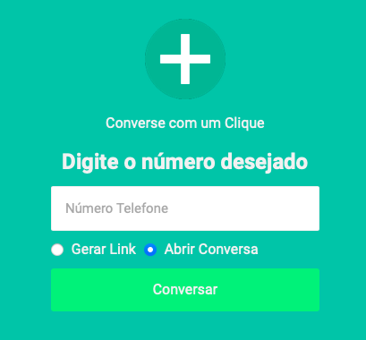

# Conversa com um Clique

> Com o recurso conversa em um clique, você pode iniciar uma conversa com alguém cujo número de telefone não está salvo na sua lista de contatos. Desde que você saiba o número de telefone dessa pessoa e que ela tenha uma conta do WhatsApp ativa. 
> -- <cite>[WhatsApp][1]</cite>

[1]: https://faq.whatsapp.com/general/chats/how-to-use-click-to-chat/?lang=pt_br

Assim, usando nosso interface simplificada, você apenas adicionará o número desejado e escolherá entre gerar o link ou abrir diretamente a conversa, de forma fácil, simples, e intuitiva. 

# Como usar

Acesse http://luizpicolo.com.br/conversa-com-um-clique/ ou leia o qrcode abaixo.

Após o acesso, digite o número desejado e escolhe entre, gerar um link ou abrir a conversa

# Desenvolvedores

Para iniciar o servidor basta rodar o código abaixo

    npm run dev

# Licença 

Este app usa a Licença MIT.